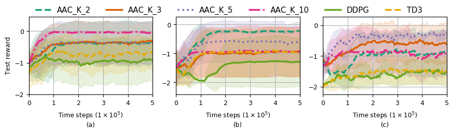
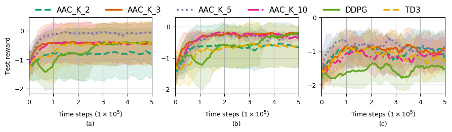

# Efficiency, Stability and Generalization Analysis for Reinforcement Learning on Robotic Peg-in-hole Assembly
> If you have any question or want to report a bug, please open an issue instead of emailing me directly. 

## Webots setup [(Webots User Guide)](https://cyberbotics.com/doc/guide)

### Installation

Follow the officical website :

First verify system requirements and graphics driver. 

Then [Download](https://cyberbotics.com/#download) debian package and install directly. 

You can also choose to installing with Advanced Packaging Tool (APT). The installation requires the **root** privileges. 

```
wget -qO- https://cyberbotics.com/Cyberbotics.asc | sudo apt-key add -
sudo apt-add-repository 'deb https://cyberbotics.com/debian/ binary-amd64/'
sudo apt-get update
sudo apt-get install webots
```

### Enviroment setup

> This step can be skip as all the settings exist in `.idea`

First make sure you have the right python version installed. We are using the external robot controller feture of Webots and PyCharm as our external IDE.

Webots Python API should be added to the project. This can be done from the **File** / **Settings** menu. In the **Settings** window, select the **Project** / **Project Structure** tab, then, the **Add Content Root** button can be used to add a new folder to the path, select the **WEBOTS_HOME/lib/controller/python37** folder (or any other Python version). The defalt value of **WEBOTS_HOME** is `/usr/local/webots`.

Next we need to setup the Environment variables.
There are 2 key variables that we need to keep track of.
| Environment variables | Typical Value |
| ------------- |:------------- |
| LD_LIBRARY_PATH | /usr/local/webots/lib |
| WEBOTS_PID | `A Process ID value` |

**WEBOTS_PID** is used to run multiple simulations at the same time. It shoud be set with the PID (Process ID) of the running Webots instance to which you want to connect your controller. Process ID can be found through the system monitor. If you are not running multiple simulations, you can delete this variable.

### Implemented algorithms:
* Deep Deterministic Policy Gradient (DDPG)
* Twined Delayed DDPG (TD3)
* Average-TD3
* adInforHRL

### Dependency
* MacOS 10.12 or Ubuntu 16.04
* PyTorch v1.1.0
* Python 3.6, 3.5
* Core dependencies: `pip install -e .`

**Change the work path to the path of your main.py**

Then run the code:
```
python ./main.py
```

### Our performance 

* Single peg-in-hole. 


* Double peg-in-hole. 


* Triple peg-in-hole. 


# References
* [Deterministic Policy Gradient Algorithms](http://proceedings.mlr.press/v32/silver14.pdf)
* [Continuous control with deep reinforcement learning](https://arxiv.org/abs/1509.02971)
* [Feedback Deep Deterministic Policy Gradient with Fuzzy Reward for Robotic Multiple Peg-in-hole Assembly Tasks](https://ieeexplore.ieee.org/abstract/document/8454796) 
* [Deep reinforcement learning for high precision assembly tasks](https://ieeexplore.ieee.org/abstract/document/8202244)
* Some hyper-parameters are from [OpenAI Baselines](https://github.com/openai/baselines) and [Deep_RL](https://github.com/ShangtongZhang/DeepRL) 
